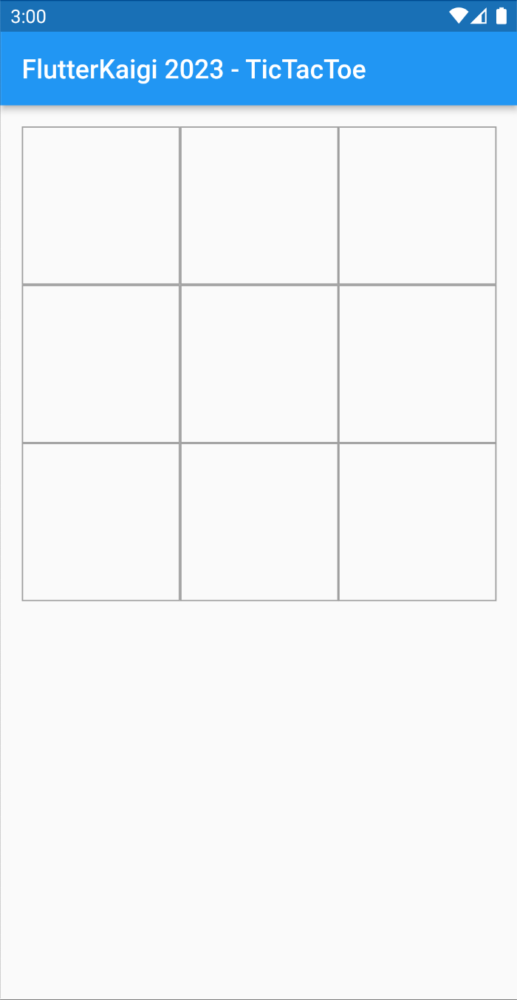
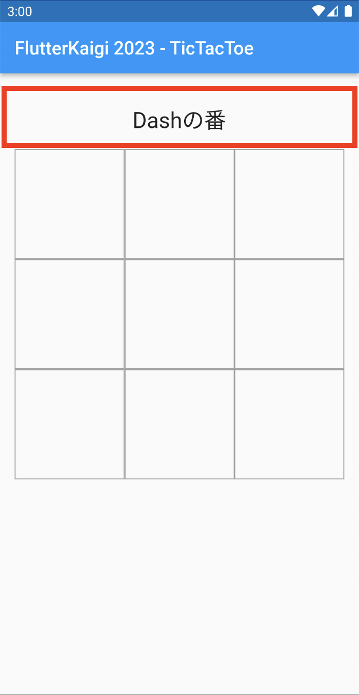

# UI の作成

## 3.1: UI の作成

### 3.1.1: 作成する UI について（三目並べのゲーム画面）

3章では、三目並べを遊ぶためのゲーム画面を作ります。  
前章で作成した「**ゲーム進行の状態を表す ゲームロジックのモデル**」を使って、  
プレーヤーがタップすることで、指手の ○×マークを配置したり、  
プレーヤーに次の指し手を促したり、ゲームの勝敗を告げたりすることを  
**モデルの状態遷移** により表現できるようにします。

<ul>
  UI完成図<br/>
  
  <!--
  
  -->
</ul>

- 脚注
  - **ゲームロジックのモデル**  
    `TicTacTow` クラスのインスタンス・オブジェクトを表します。  
    <br/>
  - **指手 / 指し手**  
    盤面に自分の戦略手（○×マーク）を打つこと。  
    もしくは、盤面に自分の戦略手（○×マーク）を置く人（プレーヤー）のこと。  
    <br/>


### 3.1.2: ゲームロジック モデル（ゲーム進行状態モデル）についてのおさらい。

1. **TicTacToe クラス**  
TicTacToe クラスは、三目並べゲームロジックのモデルですが、そのインスタンス・オブジェクトは、  
三目並べゲームの「**盤面状態値**」と「**今回のプレーヤー値**」および「**盤面更新**」「**勝敗判定**」の機能を持ち、  
「**次のゲームプレイ状態を提供**」できるようにする「**ある時点のゲーム進行状態**」を表すことができます。  
　  
「**ゲームプレイの初期状態**」や、指し手により盤面更新された「**次のゲームプレイ状態**」および、  
ゲーム再開のための「**新しいゲームプレイの初期状態**」を提供することから、  
ゲームプレイ状態を保持して状態遷移を管理するコントローラではないことに注意してください。  
<br/>

2. **Players クラス**  
   プレーヤーを表す「**先手** ×マーク」と「**後手** ○マーク」のプレーヤー名を保持するモデルです。  
   <br/>

```dart
/// TicTacToe クラスのプロパティおよびメソッドの概要一覧
class TicTacToe {
  /// 三目並べゲームの盤面状態値（行:列からなる 2次元配列）
  final List<List<String>> board;

  /// 今回のプレーヤー値（今回の指手名）
  final String currentPlayer;

  /// 勝敗判定（勝者プレーヤー名、もしくは未決着なら空文字列が返る）
  String getWinner();

  /// （勝敗判定）引分終了判定（未決着でゲーム終了なら true が返る）
  bool isDraw();

  /// 盤面更新 ファクトリパターン・メソッド（今回の指し手により更新された、次のゲーム進行状態を返す）
  TicTacToe placeMark(int row, int col);

  /// 新しいゲームプレイの初期状態 ファクトリパターン・メソッド
  TicTacToe resetBoard();

  /// ゲームプレイの初期状態 ファクトリ
  factory TicTacToe.start()
}
```

### 3.1.3: UI 作成手順 （ゲーム画面の作成ステップ）

前章までの作業は、flutter プロジェクトの新規作成とゲームロジックのモデルの新規追加までとなっています。  
このためアプリの UIは、カウンターアプリのままですから、以下の手順で、三目並べを遊ぶための画面を作り上げていきます。

1. main パッケージの修正  
   プロジェクトにゲーム画面（`Board` ⇒ はじめは空コンテンツ）を新規追加して、  
   元々のカウンターアプリから不要コードの削除とアプリタイトルの修正を行い、  
   ホーム画面を `MyHomePage` からゲーム画面に差し替えます。  
   <br/>
   <ul>
     main パッケージの修正<br/>
     
     <!--
     
     -->
     <br/>
     <br/>
   </ul>

2. 三目並べ盤面の追加  
   ゲーム画面に「ゲーム進行状態」から、**今までの指手（○×マーク）** の配置や、  
   **今回のプレーヤーの指手（○×マーク）** を配置して、次に **状態遷移** できるようにする、  
   縦横 3x3 に区切られたマス目（セル）を新規追加します。  
   <br/>
   <ul>
     三目並べ盤面の追加<br/>
     
     <!--
     
     -->
     <br/>
     <br/>
   </ul>

3. メッセージ表示欄の追加
   ゲーム画面に「ゲーム進行状態」から **今回の指手や、ゲーム勝敗終了** を表示する、  
   メッセージ欄を新規追加します。  
   <br/>
   <ul>
     メッセージ表示欄の追加<br/>
     
     <!--
     
     -->
     <br/>
     <br/>
   </ul>

4. ゲーム・リセットボタンの追加
   ゲーム画面に、新しいゲーム（ゲームプレイの初期状態）へ **状態遷移** させる  
   リセット・ボタンを追加します。  
   <br/>
   <ul>
     ゲーム・リセットボタンの追加<br/>
     
     <!--
     
     -->
     <br/>
     <br/>
   </ul>


## メモ
* もう少し細かく区切った方が良さそう
