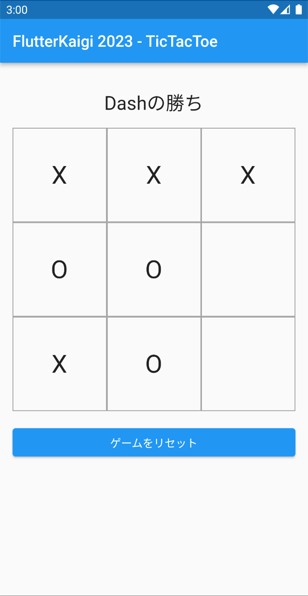
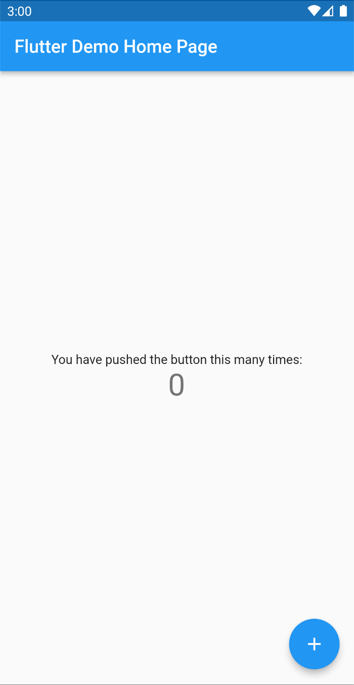
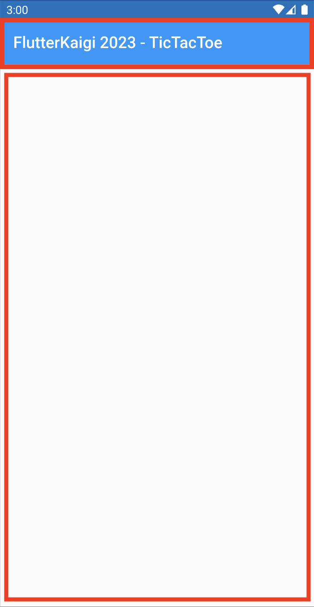
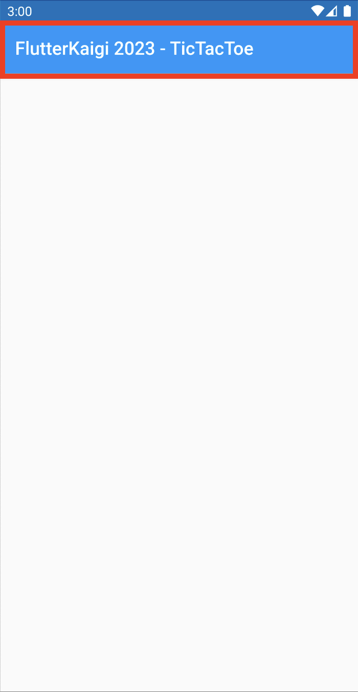
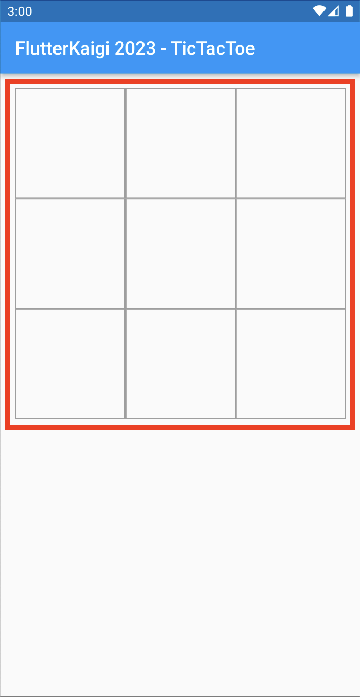
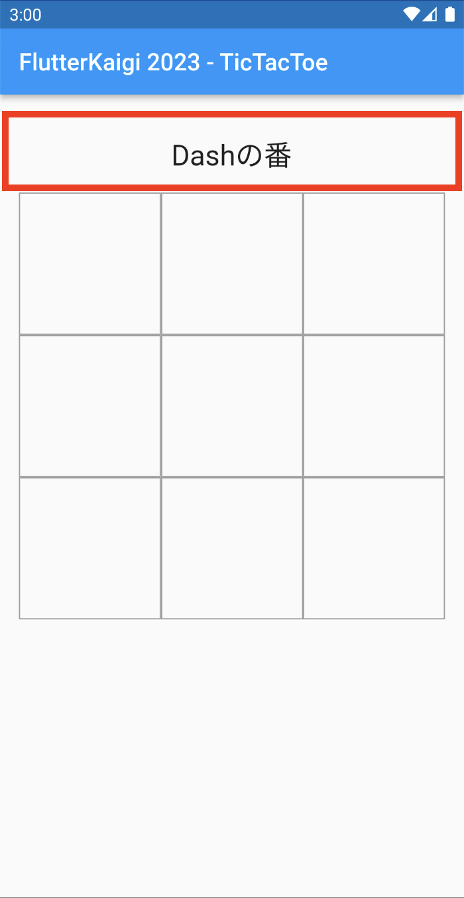
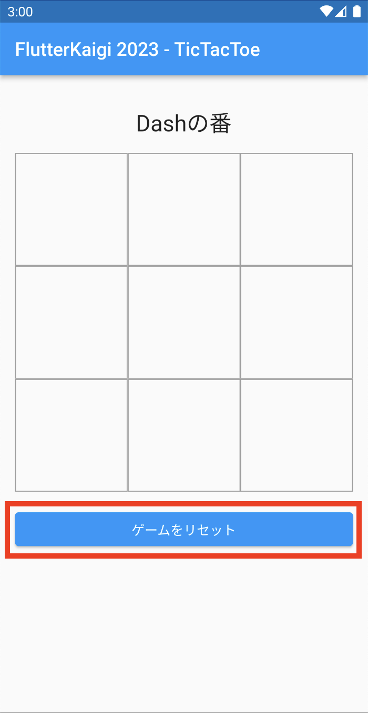
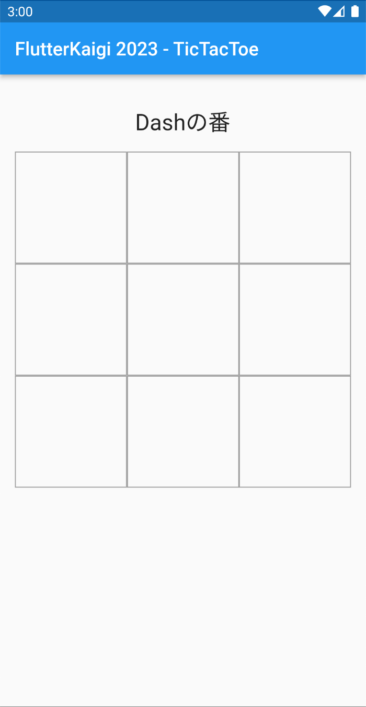

# UI の作成

## 3.1: UI の作成概要

### 3.1.1: 作成する UI について（三目並べのゲーム画面）

3章では、三目並べを遊ぶためのゲーム画面を作ります。  
作成するゲーム画面では、プレーヤーがタップすることで、指手の ○×マークを配置したり、
プレーヤーに次の指し手を促したり、ゲームの勝敗を告げたりすることができるようにします。

これらを前章で作成した「**ゲーム進行の状態を表す ゲームロジックのモデル**」を使って、  
ゲーム開始から終了までを **モデル内容の変遷 ⇒ 状態遷移** により表現できるようにします。

<ul>
  UI完成図<br/>
  
  <!--
  
  -->
</ul>

- 脚注
  - **ゲームロジックのモデル**  
    [`TicTacTow クラス`](https://github.com/FlutterKaigi/tic_tac_toe_handson/blob/release/chapter3/lib/model/tic_tac_toe.dart)のインスタンス・オブジェクトを表します。  
    <br/>
  - **指手 / 指し手**  
    盤面に自分の戦略手（○×マーク）を打つこと。  
    もしくは、盤面に自分の戦略手（○×マーク）を置く人（プレーヤー）のこと。  
    <br/>


### 3.1.2: ゲームロジック モデル（ゲーム進行状態モデル）についてのおさらい。

1. **[TicTacTow クラス](https://github.com/FlutterKaigi/tic_tac_toe_handson/blob/release/chapter3/lib/model/tic_tac_toe.dart)**  
TicTacToe クラスは、三目並べゲームロジックのモデルです。  
そのインスタンス・オブジェクトは、三目並べゲームの「**盤面状態値**」と「**今回のプレーヤー値**」および「**盤面更新**」「**勝敗判定**」の機能を持っています。  
つまり「**次のゲームプレイ状態を提供**」できるようにする「**ある時点のゲーム進行状態**」を表すことができます。  
　  
_「**ゲームプレイの初期状態**」や、指し手により盤面更新された「**次のゲームプレイ状態**」および、
ゲーム再開のための「**新しいゲームプレイの初期状態**」を提供することに留意ください。  
これはゲームプレイ状態を保持して状態遷移を管理するコントローラではないことを表します。_  
<br/>

2. **[Players クラス](https://github.com/FlutterKaigi/tic_tac_toe_handson/blob/release/chapter3/lib/model/players.dart)**  
   プレーヤーを表す「**先手** ×マーク」と「**後手** ○マーク」のプレーヤー名を保持するモデルです。  
   <br/>

**【参考】TicTacToe クラスのプロパティおよびメソッドの概要一覧**
```dart
/// TicTacToe クラスのプロパティおよびメソッドの概要一覧
class TicTacToe {
  /// 三目並べゲームの盤面状態値（行:列からなる ○×マークを配置する2次元配列）
  final List<List<String>> board;

  /// 今回のプレーヤー値（今回の指手名）
  final String currentPlayer;

  /// 勝敗判定（勝者プレーヤー名、もしくは未決着なら空文字列が返る）
  String getWinner();

  /// （勝敗判定）引分終了判定（未決着でゲーム終了なら true が返る）
  bool isDraw();

  /// 盤面更新 ファクトリパターン・メソッド（今回の指し手により更新された、次のゲーム進行状態を返す）
  TicTacToe placeMark(int row, int col);

  /// 新しいゲームプレイの初期状態 ファクトリパターン・メソッド
  TicTacToe resetBoard();

  /// ゲームプレイの初期状態 ファクトリ
  factory TicTacToe.start()
}
```


### 3.2: UI 作成手順概要 （ゲーム画面の作成ステップ）

前章までの作業は、flutter プロジェクトの新規作成とゲームロジックのモデルの新規追加までとなっています。  
このためアプリの UIは、カウンターアプリのままですから、以下の手順で、三目並べを遊ぶための画面を作り上げていきます。

1. main パッケージの修正  
   前章でのアプリの UIは、カウンターアプリのままです。  
   このためプロジェクトにゲーム画面（`Board` ⇒ はじめは空コンテンツ）を新規追加します。  
   次に元々のカウンターアプリから不要コードの削除とアプリタイトルの修正を行い、  
   ホーム画面を `MyHomePage` からゲーム画面（はじめは空コンテンツ）に差し替えます。  
   <br/>
   <ul>
     <a href="https://github.com/FlutterKaigi/tic_tac_toe_handson/blob/release/chapter2/lib/main.dart">修正前 main パッケージ</a><br/>
     
     <!--
     
     -->
     <br/>
     <br/>
   </ul>
   <ul>
     main パッケージの修正<br/>
     
     <!--
     
     -->
     <br/>
     <br/>
   </ul>

2. 三目並べ盤面の追加  
   ゲーム画面（`Board`）に「ゲーム進行状態」から、**今までの指手（○×マーク）** の配置や、
   **今回のプレーヤーの指手（○×マーク）** を配置して、次の**ゲーム進行状態**に **状態遷移** できるようにします。  
   このために縦横 3x3 に区切られたマス目（セル）を新規追加します。  
   <br/>
   <ul>
     三目並べ盤面の追加<br/>
     
     <!--
     
     -->
     <br/>
     <br/>
   </ul>

3. メッセージ表示欄の追加  
   ゲーム画面に「ゲーム進行状態」から **今回の指手や、ゲーム勝敗終了** を表示する、  
   メッセージ欄を新規追加します。  
   <br/>
   <ul>
     メッセージ表示欄の追加<br/>
     
     <!--
     
     -->
     <br/>
     <br/>
   </ul>

4. ゲーム・リセットボタンの追加  
   ゲーム画面に、新しいゲーム（ゲームプレイの初期状態）へ **状態遷移** させる  
   リセット・ボタンを追加します。  
   <br/>
   <ul>
     ゲーム・リセットボタンの追加<br/>
     
     <!--
     
     -->
     <br/>
     <br/>
   </ul>


### 3.3: UI 作成作業 （ゲーム画面の具体的作成ステップ）

三目並べを遊ぶための画面 UIの作成ステップを紹介しましたので、具体的な作業に入りましょう。

#### 3.3.1: main パッケージの修正

##### 1. ゲーム画面ウィジェット（はじめは空コンテンツの）を新規作成
プロジェクトにゲーム画面（`Board` ⇒ はじめは空コンテンツ）を新規追加します。  
IDEやエディタで `libディレクトリ`に `view ディレクトリ`を新規追加して、空コンテンツのゲーム画面(`board.dart`)ファイルを追加してください。

<br/>

- **空コンテンツのゲーム画面(Board) ウィジェットのコードファイル**  
  コードファイル名 board.dart、パッケージ配置先 ⇒ lib/view/board.dart
``` dart
import 'package:flutter/material.dart';

class Board extends StatefulWidget {
  const Board({Key? key}) : super(key: key);

  @override
  State<StatefulWidget> createState() {
    return _BoardState();
  }
}

class _BoardState extends State<Board> {
  @override
  Widget build(BuildContext context) {
    // 画面いっぱいに描画領域だけを確保しています。
    return const SizedBox.expand();
  }
}
```
<br/>


##### 2. 不要コードの削除（コメント削除）  
カウンターアプリのコードには、たくさんのコメントがあります。  
コードの見通しを良くするため[`MaterialApp`](https://api.flutter.dev/flutter/material/MaterialApp-class.html)の中にある 
[`ThemeData`](https://api.flutter.dev/flutter/material/ThemeData-class.html)のコメントを削除しましょう。  
またダークテーマ対応として、MaterialAppのプロパティ [darkTheme](https://api.flutter.dev/flutter/material/MaterialApp/darkTheme.html) を設定するコード ⇒ `darkTheme: ThemeData.dark(),`を追加してみてください。  

- _MaterialAppは、[マテリアルライブラリ](https://api.flutter.dev/flutter/material/material-library.html)に属する **アプリケーション構成** を提供するウィジェットです。_  
_[マテリアルライブラリ](https://api.flutter.dev/flutter/material/material-library.html)は、[マテリアルデザイン](https://m3.material.io/)が実装された **Flutterウィジェット** を提供します。_

- _ThemeDataは、アプリ内のウィジェット全般の色やテキストスタイルなどのビジュアルテーマを指定するウィジェトです。_

- _darkThemeは、システム設定からダークテーマが指定されたときにアプリのビジュアルテーマを指定するプロパティです。_

- _ThemeDataによりアプリ全般の設定ができることを確認してみましょう。_  
  _時間があれば ThemeDataのプロパティ [scaffoldBackgroundColor](https://api.flutter.dev/flutter/material/ThemeData/scaffoldBackgroundColor.html)にコード ⇒ `scaffoldBackgroundColor: Colors.amber,` を追加して背景色が変化することを確認してみてください。_

<br/>

- **作業後の MaterialApp と ThemeData のコード内容**
``` dart
 〜 省略 〜
  @override
  Widget build(BuildContext context) {
    return MaterialApp(
      title: 'Flutter Demo',
      theme: ThemeData(
        primarySwatch: Colors.blue,
      ),
      darkTheme: ThemeData.dark(), //【新規追加】
      home: const MyHomePage(title: 'Flutter Demo Home Page'),
    );
  }
 〜 省略 〜
```
<br/>


##### 3. 不要コードの削除（ホーム画面削除）
次にホーム画面を `MyHomePage` から、アプリ画面の足場([`Scaffold`](https://api.flutter.dev/flutter/material/Scaffold-class.html))に差し替えます。  
_差し替えが終わりましたら、不要になった `MyHomePage` と `_MyHomePageState` を削除してください。_

- _Scaffoldは、アプリ画面に [アプリバー](https://api.flutter.dev/flutter/material/Scaffold/appBar.html)や [ボディ(表示コンテンツ)](https://api.flutter.dev/flutter/material/Scaffold/body.html)などの足場を提供するウィジェトです。_

<br/>

- **作業後の MaterialApp: homeプロパティのコード内容**
``` dart
 〜 省略 〜
  @override
  Widget build(BuildContext context) {
    return MaterialApp(
      title: 'Flutter Demo',
      theme: ThemeData(
        primarySwatch: Colors.blue,
      ),
      darkTheme: ThemeData.dark(),
      home: Scaffold(), //【コード差替】
    );
  }
 〜 省略 〜
```
<br/>


##### 4. アプリタイトル表示を追加
一つ前の作業ステップで、`MyHomePage`を削除したのでアプリバーがなくなっています。  
アプリバーを表示させるため [`Scaffold`](https://api.flutter.dev/flutter/material/Scaffold-class.html)の **アプリバー・プロパティ([appBar](https://api.flutter.dev/flutter/material/Scaffold/appBar.html))** に
**アプリケーションバー・ウィジェット([AppBar](https://api.flutter.dev/flutter/material/AppBar-class.html))** を追加します。

画面にアプリバーが追加されたのでハンズオン・アプリを示すよう、
`AppBar`の **タイトル・プロパティ([title](https://api.flutter.dev/flutter/material/AppBar/title.html))** に **'FlutterKaigi 2023 - TicTacToe'** を設定します。  
また `MaterialApp`の **タイトル・プロパティ([title](https://api.flutter.dev/flutter/material/MaterialApp/title.html))** にも同様に **'FlutterKaigi 2023 - TicTacToe’** を設定してください。

<br/>

- **作業後の MaterialApp と Scaffold のコード内容**
``` dart
 〜 省略 〜
  @override
  Widget build(BuildContext context) {
    return MaterialApp(
      title: 'FlutterKaigi 2023 - TicTacToe', //【タイトル差替】アプリ説明のタイトル
      theme: ThemeData(
        primarySwatch: Colors.blue,
      ),
      darkTheme: ThemeData.dark(),
      home: Scaffold(
        appBar: AppBar(                                       //【新規追加】アプリバー
          title: const Text('FlutterKaigi 2023 - TicTacToe'), //【新規追加】アプリのタイトル
        ),                                                    //【新規追加】
      ),
    );
  }
 〜 省略 〜
```
<br/>


##### 5. アプリコンテンツ（ゲーム画面）表示を追加
アプリバーを追加したので、残るゲーム画面をアプリボディに追加しましょう。  
ゲーム画面を表示させるため [`Scaffold`](https://api.flutter.dev/flutter/material/Scaffold-class.html)の 
**ボディ・プロパティ([body](https://api.flutter.dev/flutter/material/Scaffold/body.html))** に **ゲーム画面・ウィジェット(`Board`)** を追加します。

_【注意】現状のゲーム画面(`Board`)は、何も表示するものがありません。_

<br/>

- **作業後の main パッケージ内容**  
``` dart
import 'package:flutter/material.dart';
import 'package:tic_tac_toe_handson/view/board.dart';

class MyApp extends StatelessWidget {
  const MyApp({Key? key}) : super(key: key);

  @override
  Widget build(BuildContext context) {
    return MaterialApp(
      title: 'FlutterKaigi 2023 - TicTacToe',
      theme: ThemeData(
        primarySwatch: Colors.blue,
      ),
      darkTheme: ThemeData.dark(),
      home: Scaffold(
        appBar: AppBar(
          title: const Text('FlutterKaigi 2023 - TicTacToe'),
        ),
        body: const Board(), //【新規追加】ゲーム画面ウィジェット
      ),
    );
  }
}
```

<br/>
<ul>
  main パッケージ修正後のアプリ画面<br/>
  
  <!--
  
  -->
  <br/>
  <br/>
</ul>
<br/>


#### 3.3.2: 三目並べ盤面の追加

##### 1. 空コンテンツのゲーム画面の修正
前章で新規作成した **空コンテンツのゲーム画面(`Board ウィジェット`)** は、画面いっぱいに空欄を表示するだけでした。  
ゲーム画面は、三目並べ盤面だけではなくメッセージ欄もありますので、任意複数のコンテンツを追加できるように修正します。

三目並べのゲーム画面は、縦方向にコンテンツが並びます。 このためコンテンツを列表示させる **[Column ウィジェット](https://api.flutter.dev/flutter/widgets/Column-class.html)** を使います。  
そしてコンテンツが画面端に付かないようにする ⇒ 四方枠に空隙をとる ⇒ ため、`Column` を **[Padding ウィジェット](https://api.flutter.dev/flutter/widgets/Padding-class.html)** でラップします。  
このような設計により最初のコード ```return const SizedBox.expand();``` を、**Paddingと Columnの入れ子** に差し替えます。  
_具体的なコードは、（修正後）空コンテンツのゲーム画面のコードを参照ください。_

最後にゲームの進行が **ゲーム開始から終了まで**の **状態遷移**で表現できるよう、  
**[StatefulWidget](https://api.flutter.dev/flutter/widgets/StatefulWidget-class.html)** の **[State](https://api.flutter.dev/flutter/widgets/State-class.html)** に 
**ゲーム進行状態のモデル([TicTacTow クラス](https://github.com/FlutterKaigi/tic_tac_toe_handson/blob/release/chapter3/lib/model/tic_tac_toe.dart))** を保持させます。

- _[Column](https://api.flutter.dev/flutter/widgets/Column-class.html)は、複数の子ウィジェットを縦方向の列並びにするレイアウト・ウィジェットです。_
- _[Row](https://api.flutter.dev/flutter/widgets/Row-class.html)は、複数の子ウィジェットを横方向の行並びにするレイアウト・ウィジェットです。_
- _[Padding](https://api.flutter.dev/flutter/widgets/Padding-class.html)は、子ウィジェットの四方に空隙を詰めるウィジェットです。_

<br/>

- **（修正後）空コンテンツのゲーム画面(Board) ウィジェットのコードファイル**  
  コードファイル名 board.dart、パッケージ配置先 ⇒ lib/view/board.dart
```dart
import 'package:flutter/material.dart';

class Board extends StatefulWidget {
  const Board({Key? key}) : super(key: key);

  @override
  State<StatefulWidget> createState() {
    return _BoardState();
  }
}

class _BoardState extends State<Board> {
  TicTacToe ticTacToe = TicTacToe.start(playerX: 'Dash', playerO: 'Sparky'); //【新規追加】ゲーム進行状態の初期値

  @override
  Widget build(BuildContext context) {
    return Padding(                      //【差替】子ウィジェットの周りに空隙を指定します。
      padding: const EdgeInsets.all(16), //【差替】子ウィジェットの四方周りに 16pixelの空隙を指定。
      child: Column(                     //【差替】列方向(縦並び)のコンテンツウィジェット表示を指定します。
        children: [                      //【差替】列方向表示コンテンツウィジェットのリスト
        ],                               //【差替】（現時点では、ヘッダやボディなどの表示コンテンツはありません）
      ),                                 //【差替】
    );                                   //【差替】
  }
}
```
<br/>


#### 2. ３×３のマス目の追加（セル追加）
三目並べ盤面には、３×３のマス目があります。  
ここでは、**[GridView](https://api.flutter.dev/flutter/widgets/GridView-class.html)** という
**グリッド ⇒ ウィジェットの2D配列 ⇒ 縦横格子レイアウト** を行うウィジェットを使ってマス目を表現します。  
_具体的なコードは、（修正後）ゲーム画面のコードを参照ください。_

- _[GridView](https://api.flutter.dev/flutter/widgets/GridView-class.html)は、いくつかの状況に対応できるよう複数のコンストラクタがあります。_  
_ハンズオンでは、[builderコンストラクタ](https://api.flutter.dev/flutter/widgets/GridView/GridView.builder.html)を使って、_
_横方向 3個のアイテムを 9個分描画させることで３×３のマス目を表現しています。_

<br/>

- **（修正後）ゲーム画面(Board) ウィジェットのコード内容**
```dart
      〜 省略 〜
      child: Column(
        children: [
          //【新規追加】（ここから）
          // 三目並べ盤面
          GridView.builder(
            shrinkWrap: true,
            gridDelegate: const SliverGridDelegateWithFixedCrossAxisCount(
              crossAxisCount: 3, //横方向のマス個数（３個）
            ),
            itemCount: 9, //縦横のマス個数（３×３）
            itemBuilder: (context, index) {
              return const SizedBox.expand(); //マス目に空欄を確保するだけのダミー
            },
          ),
          //
          //【新規追加（ここまで）
        ],
      ),
      〜 省略 〜
```
<br/>


#### 3. ３×３のマス目の追加（縦横の罫線表示）
三目並べ盤面の３×３のマス目が確保できたので、各マスに縦横の罫線を引きましょう。  
ここでは **[Container ウィジェット](https://api.flutter.dev/flutter/widgets/Container-class.html)** の 
**[decoration プロパティ](https://api.flutter.dev/flutter/widgets/Container/decoration.html)** に
**[BoxDecoration](https://api.flutter.dev/flutter/painting/BoxDecoration-class.html)** を指定して、**枠線** を描画させます。

各マス目に空欄を確保するだけのダミー ```return const SizedBox.expand();``` を `Container`に差し替えます。  
_具体的なコードは、（修正後）ゲーム画面のコードを参照ください。_

- _[Container](https://api.flutter.dev/flutter/widgets/Container-class.html)は、自分の描画領域や子ウィジェットに制約を与えるウィジェットです。_  
  _このため自分の描画領域にサイズや背景色や枠線を、子ウィジェットに配置位置(右寄、中央寄、etc)や変形などの制約を与えることができます。_  

- 【注意】正確にいえば罫線でなく枠線を描画しています。  
   　　　　このため内側罫線よりも外枠が細くなっていることに注意ください。

<br/>

- **（修正後）ゲーム画面(Board) ウィジェットのコード内容**  
```dart
            〜 省略 〜
            itemBuilder: (context, index) {
              //【差替】（ここから）
              return Container(
                //マス目の縦横罫線をGrayで描画
                decoration: BoxDecoration(
                  border: Border.all(color: Colors.grey),
                ),
              );
              //【差替】（ここまで）
            },
            〜 省略 〜
```
<br/>


#### 4. ３×３のマス目の追加（○×マーク表示）
三目並べ盤面の３×３のマス目には、先攻と後攻指手の○×マークが描画されます。  
先攻と後攻指手の○×マークは、ある時点の **ゲーム進行状態のモデル([TicTacTow クラス](https://github.com/FlutterKaigi/tic_tac_toe_handson/blob/release/chapter3/lib/model/tic_tac_toe.dart)) オブジェクト** の
2次元配列(`List<List<String>> board`)に記録されているので、以下のような行列判定と○×マークを取得するコードを追加します。

```dart
itemBuilder: (context, index) {
  // マス目ごとの行と列を判定し、カレントマス目の ○×（あるいは空文字列）マークを取得する。
  int row = index ~/ 3;
  int col = index % 3;
  String mark = ticTacToe.board[row][col]; //○× または空文字列を返す。
}
```

またマス目ごとに ○×マークを描画するため、`Containerの childプロパティ`に `Text(mark)`を追加します。  
_具体的なコードは、（修正後）ゲーム画面のコードを参照ください。_

_**先攻と後攻の指手が交代するごとに、ゲーム盤面全体が更新される** ことに留意ください。_

<br/>

- **（修正後）ゲーム画面(Board) ウィジェットのコード内容**
```dart
            〜 省略 〜
            itemBuilder: (context, index) {
              //【新規追加】（ここから）
              final row = index ~/ 3;
              final col = index % 3;
              final mark = ticTacToe.board[row][col]; //ゲーム進捗状態から、マス目に対応する○×マークを取得
              //【新規追加（ここまで）

               return Container(
                //マス目の縦横罫線をGrayで描画
                decoration: BoxDecoration(
                  border: Border.all(color: Colors.grey),
                ),
                //【新規追加】（ここから）
                child: Center(
                  //マス目の ○×マーク（もしくは空欄）を描画
                  child: Text(
                    mark,
                    style: const TextStyle(fontSize: 32),
                  ),
                ),
                //【新規追加（ここまで）
              );
              〜 省略 〜
```
<br/>


#### 5. ３×３のマス目の追加（マス目のタップイベント追加）
三目並べ盤面の３×３のマス目は、タップにより**新しい指し手**（○×マーク）が配置されて、次の対局に進みます。

これはタップされたマス目により、**カレント指し手**が有効であるか ⇒ ○×マーク配置可能か否かを判定し、
有効であれば**カレント指し手が記録された「新しいゲーム進行状態」に状態遷移する**ことが求められることを示します。

タップ・イベントをハンドリングするウィジェット ⇒ タップに対応する任意処理を指定できるウィジェットには、
**[GestureDetector](https://api.flutter.dev/flutter/widgets/GestureDetector-class.html)** があります。  
[GestureDetector](https://api.flutter.dev/flutter/widgets/GestureDetector-class.html)は、
[child プロパティ](https://api.flutter.dev/flutter/widgets/GestureDetector/child.html)にタップを監視するウィジェットを指定でき、
[onTap プロパティ](https://api.flutter.dev/flutter/widgets/GestureDetector/onTap.html)にタップ時の対応を指定できます。  

ハンドラでは、タップされると **カレント指し手が有効か否か**を判定し、有効であれば **カレント指し手がマス目に配置された三目並べの盤面を作成** させるため、
**ゲーム進行状態のモデル([TicTacTow クラス](https://github.com/FlutterKaigi/tic_tac_toe_handson/blob/release/chapter3/lib/model/tic_tac_toe.dart))の placeMark(row, col)** を実行することになります。  

よってこれらの処理が、**[StatefulWidget](https://api.flutter.dev/flutter/widgets/StatefulWidget-class.html)** の状態を更新する
**[State](https://api.flutter.dev/flutter/widgets/State-class.html)** の
**[setState()](https://api.flutter.dev/flutter/widgets/State/setState.html)** で実行されるようにすれば良いことになります。

```dart
setState(() {
  //カレント指し手が有効か否かをチェックするため、カレント指し手のマス目(mark)が現在空欄であり、勝敗もついていないことを確認する。
  final winner = ticTacToe.getWinner();
  if (mark.isEmpty && winner.isEmpty) {
    //カレント指し手が有効であれば、カレント指し手がゲーム盤面に反映された「新しいゲーム進行状態」を生成する。
    ticTacToe = ticTacToe.placeMark(row, col);
  }
});
```

ここでは、`GestureDetector`でマス目を描画する `Container`をラップし `onTap ハンドラ`を使ってタップのハンドリングを行なわせましょう。  
_具体的なコードは、（修正後）ゲーム画面のコードを参照ください。_

- 【備考】新しいゲーム進行状態への状態遷移により、カレント指し手がマス目に描画されます。  
  　　　　この描画は１つ前で追加した、**３×３のマス目の追加（○×マーク表示）** により行われます。

<br/>

- **（修正後）ゲーム画面(Board) ウィジェットのコード内容**
```dart
            〜 省略 〜
            itemBuilder: (context, index) {
              final row = index ~/ 3;
              final col = index % 3;
              final mark = ticTacToe.board[row][col];

              //【修正】新規追加した GestureDetectorの childで、Containerをラップ（ここから）
              return GestureDetector(                            //【新規追加】
                onTap: () {                                      //【新規追加】
                  setState(() {                                  //【新規追加】
                    final winner = ticTacToe.getWinner();        //【新規追加】
                    if (mark.isEmpty && winner.isEmpty) {        //【新規追加】
                      ticTacToe = ticTacToe.placeMark(row, col); //【新規追加】
                    }                                            //【新規追加】
                  });                                            //【新規追加】
                },                                               //【新規追加】
                child: Container(
                  decoration: BoxDecoration(
                    border: Border.all(color: Colors.grey),
                  ),
                  child: Center(
                    child: Text(
                      mark,
                      style: const TextStyle(fontSize: 32),
                    ),
                  ),
                ),
              );                                                　//【新規追加】
              //【修正】新規追加した GestureDetectorの childで、Containerをラップ（ここまで）
            },
            〜 省略 〜
```
<br/>


#### 6. 三目並べ盤面の追加（修正全容）
- **（修正全容）ゲーム画面(Board) ウィジェットのコード内容**
```dart
class _BoardState extends State<Board> {
  TicTacToe ticTacToe = TicTacToe.start(playerX: 'Dash', playerO: 'Sparky');

  @override
  Widget build(BuildContext context) {
    return Padding(
      padding: const EdgeInsets.all(16),
      child: Column(
        children: [
          //【新規追加】（ここから）
          // 三目並べ盤面
          GridView.builder(
            shrinkWrap: true,
            gridDelegate: const SliverGridDelegateWithFixedCrossAxisCount(
              crossAxisCount: 3,
            ),
            itemCount: 9,
            itemBuilder: (context, index) {
              final row = index ~/ 3;
              final col = index % 3;
              final mark = ticTacToe.board[row][col];

              return GestureDetector(
                onTap: () {
                  setState(() {
                    final winner = ticTacToe.getWinner();
                    if (mark.isEmpty && winner.isEmpty) {
                      ticTacToe = ticTacToe.placeMark(row, col);
                    }
                  });
                },
                child: Container(
                  decoration: BoxDecoration(
                    border: Border.all(color: Colors.grey),
                  ),
                  child: Center(
                    child: Text(
                      mark,
                      style: const TextStyle(fontSize: 32),
                    ),
                  ),
                ),
              );
            },
          ),
          //
          //【新規追加（ここまで）
        ],
      ),
    );
  }
}
```
<br/>

<ul>
  三目並べ盤面の追加（修正全容）<br/>
  
  <!--
  
  -->
  <br/>
  <br/>
</ul>
<br/>


#### 3.3.3: メッセージ表示欄の追加
「ゲーム進行状態」から **今回の指手や、ゲーム勝敗終了** を表示する、メッセージ欄を新規追加します。  

##### 1. ゲーム進行状態からメッセージを作るロジックの追加
ゲームの進行は、「対局の勝敗が決定する」まで繰り返されます。  
これは「現在未決着なので、次の指し手を依頼」の繰り返しから、「既にいずれかが勝利したのでゲーム終了」まで **状態遷移**を続けることでもあります。  
つまりゲーム進行状態 ⇒ **ゲーム進行状態のモデル([TicTacTow クラス](https://github.com/FlutterKaigi/tic_tac_toe_handson/blob/release/chapter3/lib/model/tic_tac_toe.dart)) オブジェクト** の状況から、
**現在未決着**と判定されれば **次の指し手を依頼**し、**既にいずれかが勝利**と判定されれば **いずれかの勝利でゲーム終了**のメッセージが作られれば良いことになります。  
このロジックを関数化すると、以下のようになります。

```dart
/// 今回の指し手の依頼や、勝利か引き分けかのメッセージを作成
String _statusMessage(TicTacToe ticTacToe) {
  //三目並べ盤面状況から、勝利者を判定
  final winner = ticTacToe.getWinner();

  //三目並べ盤面状況から、引き分けを判定
  final isDraw = ticTacToe.isDraw();

  if (winner.isNotEmpty) {
    return '$winnerの勝ち';
  } else if (isDraw) {
    return '引き分けです';
  } else {
    //勝利も引き分けでもないので、次の指し手を依頼
    return '${ticTacToe.currentPlayer}の番';
  }
}
```

それでは、ゲーム画面のステートを表す `_BoardState`の末尾に、この `_statusMessage()`関数を追加しましょう。  
_具体的なコードは、（修正後）ゲーム画面のコードを参照ください。_
<br/>

- **（修正後）ゲーム画面(Board) ウィジェットのコード内容**
```dart
class _BoardState extends State<Board> {
  TicTacToe ticTacToe = TicTacToe.start(playerX: 'Dash', playerO: 'Sparky');

  〜 省略 〜

  //【新規追加】（ここから）
  /// 今回の指し手の依頼や、勝利か引き分けかのメッセージを作成
  String _statusMessage(TicTacToe ticTacToe) {
    final winner = ticTacToe.getWinner();
    final isDraw = ticTacToe.isDraw();

    if (winner.isNotEmpty) {
      return '$winnerの勝ち';
    } else if (isDraw) {
      return '引き分けです';
    } else {
      return '${ticTacToe.currentPlayer}の番';
    }
  }
  //【新規追加】（ここまで）
}
```
<br/>


##### 2. メッセージを表示する Textウィジェットの追加
ゲーム進行状態から、「今回の指し手の依頼や、勝利か引き分けかのメッセージ」を作る `_statusMessage()`関数が追加されたので、
ゲーム画面のヘッダーにメッセージを表示する **Textウィジェット**を追加します。

さらにメッセージが画面端に付かないようにする ⇒ 四方枠に空隙をとる ⇒ ため、
**Textウィジェット**を **[Padding ウィジェット](https://api.flutter.dev/flutter/widgets/Padding-class.html)** でラップしましょう。  
_具体的なコードは、（修正後）ゲーム画面のコードを参照ください。_

- _**[Theme.of(BuildContext)](https://api.flutter.dev/flutter/material/Theme/of.html)** メソッドは、_
  _**[ThemeData](https://api.flutter.dev/flutter/material/ThemeData-class.html) オブジェクト**を返します。_  
  _その **[textTheme プロパティ](https://api.flutter.dev/flutter/material/ThemeData/textTheme.html)** は、TextThemeを表します。_

- _**[TextTheme](https://api.flutter.dev/flutter/material/TextTheme-class.html)** は、_
  _[マテリアルデザイン]((https://m3.material.io/)のテキスト・テーマを表します。_  
  _**[headlineSmall プロパティ](https://api.flutter.dev/flutter/material/TextTheme/headlineSmall.html)** は、最小の見出しスタイルです。_

<br/>

- **（修正全容）ゲーム画面(Board) ウィジェットのコード内容**
```dart
        〜 省略 〜
        children: [
          //【新規追加】（ここから）
          // メッセージ表示欄
          Padding(
            padding: const EdgeInsets.all(16),
            child: Text(
              _statusMessage(ticTacToe),
              style: Theme.of(context).textTheme.headlineSmall,
            ),
          ),
          //【新規追加（ここまで）
          //
          〜 省略 〜
```
<br/>


#### 3. メッセージ表示欄の追加（修正全容）
- **（修正全容）ゲーム画面(Board) ウィジェットのコード内容**
```dart
class _BoardState extends State<Board> {
  TicTacToe ticTacToe = TicTacToe.start(playerX: 'Dash', playerO: 'Sparky');

  @override
  Widget build(BuildContext context) {
    return Padding(
      padding: const EdgeInsets.all(16),
      child: Column(
        children: [
          //【新規追加】（ここから）
          // メッセージ表示欄
          Padding(
            padding: const EdgeInsets.all(16),
            child: Text(
              _statusMessage(ticTacToe),
              style: Theme.of(context).textTheme.headlineSmall,
            ),
          ),
          //【新規追加（ここまで）
          //
          // 三目並べ盤面
          GridView.builder(
            shrinkWrap: true,
            gridDelegate: const SliverGridDelegateWithFixedCrossAxisCount(
              crossAxisCount: 3,
            ),
            itemCount: 9,
            itemBuilder: (context, index) {
              final row = index ~/ 3;
              final col = index % 3;
              final mark = ticTacToe.board[row][col];

              return GestureDetector(
                onTap: () {
                  setState(() {
                    final winner = ticTacToe.getWinner();
                    if (mark.isEmpty && winner.isEmpty) {
                      ticTacToe = ticTacToe.placeMark(row, col);
                    }
                  });
                },
                child: Container(
                  decoration: BoxDecoration(
                    border: Border.all(color: Colors.grey),
                  ),
                  child: Center(
                    child: Text(
                      mark,
                      style: const TextStyle(fontSize: 32),
                    ),
                  ),
                ),
              );
            },
          ),
          //
        ],
      ),
    );
  }

  //【新規追加】（ここから）
  // 今回の指し手の依頼や、勝利か引き分けかのメッセージを作成
  String _statusMessage(TicTacToe ticTacToe) {
    final winner = ticTacToe.getWinner();
    final isDraw = ticTacToe.isDraw();

    if (winner.isNotEmpty) {
      return '$winnerの勝ち';
    } else if (isDraw) {
      return '引き分けです';
    } else {
      return '${ticTacToe.currentPlayer}の番';
    }
  }
  //【新規追加】（ここまで）
}
```
<br/>

<ul>
  メッセージ表示欄の追加（修正全容）<br/>
  
  <!--
  
  -->
  <br/>
  <br/>
</ul>
<br/>


#### 3.3.4: ゲーム・リセットボタンの追加
ゲーム画面に、新しいゲーム（ゲームプレイの初期状態）へ **状態遷移** させる  
リセット・ボタンを追加します。  


#### 3.3.5: 三目並べのゲーム画面完成（ゲーム盤UI 作成作業完了）
[**完成した main パッケージのコード**](https://github.com/FlutterKaigi/tic_tac_toe_handson/blob/release/chapter3/lib/main.dart)

[**完成したゲーム画面(Board)のコード**](https://github.com/FlutterKaigi/tic_tac_toe_handson/blob/release/chapter3/lib/view/borad.dart)


### 3.4: ゲーム画面についての説明 （ゲーム盤UI 構成説明）


## コントリビューター

<BaseProfile avatar-url="/staff/rie-kanetaka.png" name="robo" title="既存 iOS/Android ネイティブアプリの Flutter リプレースに携わっています。Flutter の底力を見てください。" twitter-url="https://twitter.com/cch_robo" />

### メモ
* もう少し細かく区切った方が良さそう
